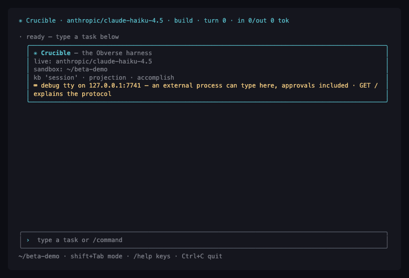
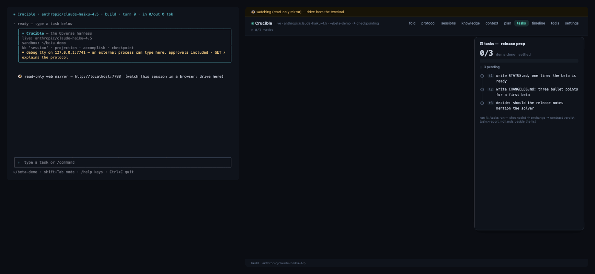

# Crucible

**An AI agent harness with a memory you own, permissions you set, and undo
that actually undoes.** One executable, no install: a rich terminal UI, a
browser co-driver mirroring the same session, a persistent knowledge base
that packs itself into every prompt by relevance, per-turn git checkpoints
(`/retract` rewinds the files *and* the conversation together), unattended
task lists whose ticks are **proven by contract** — the harness checks the
work, the model doesn't get to grade itself — and a constraint solver the
model can call as a tool.

> **Beta 0.8.167 — download:**
> [**macOS** (Apple silicon, signed & notarized)](https://raw.githubusercontent.com/bakkemo/crucible/master/releases/crucible-beta-0.8.167.zip)
> · [**Windows** (x64)](https://raw.githubusercontent.com/bakkemo/crucible/master/releases/crucible-beta-windows-0.8.167.zip)
> · or from the [latest release](https://github.com/bakkemo/crucible/releases/latest).
> Unzip, read `READ-ME-FIRST.txt`, run. No API key needed to try it:
> keyless sessions run against a deterministic offline stand-in, and the
> banner tells you honestly which one you're on.

## Why another harness

Look at what a harness actually *does*, semantically:

| Harness pattern | What it actually is |
|---|---|
| try model A, else model B | **ordered choice with failure** |
| best-of-n sampling | **collect all solutions** of a nondeterministic computation |
| retry on transient error | **re-attempt a failing branch** |
| validate structured output against a schema | **unification** against a pattern with holes |
| fan out sub-tasks, join the results | **dataflow variables** |
| react to a streaming response | **partial data**, refined incrementally |
| speculative execution of plans | **choice + rollback** |

Every row is a concept functional logic programming had first-class forty
years before harnesses existed — failure and choice are Prolog, dataflow
variables are Oz, streams as incrementally-bound structure are Concurrent
Prolog. Written in a mainstream language anyway, a harness becomes a swamp
of `async`/`await`, retry libraries, and hand-rolled state machines — none
of it essential complexity.

So Crucible is built the other way: on **Obverse** https://bakkemo.github.io/obverse-playground/, a Verse-inspired
functional logic language designed alongside it, where those semantics are
the language. The thesis in one line: *stop encoding these semantics in a
language that lacks them.* Fallbacks, races, retries, schema validation,
speculative plans — in Crucible these are language constructs doing what
they say, not libraries fighting the language. That is what makes the
features below cheap enough to actually exist: real rollback, contract-
proven task lists, a solver in the tool manifest.

You never need to see Obverse to use Crucible — you type English and answer
approval prompts. It's there for the day you want to write a skill of your
own.

## The terminal

A real session — a fact worth remembering is offered to the knowledge base,
the harness asks first, the accounting row prices the turn:

## The terminal and the browser, one session

The same session mirrored live in a browser (`--serve`) while a task list
runs unattended: each checklist item is executed, then its **contract** is
checked against the sandbox — ticks land as *proven*, not claimed. The web
panel's rail shows per-item verdicts, checkpoints, and cost.

## What's in the zip

| file | what it is |
| --- | --- |
| `crucible` / `crucible.exe` | the whole program, one file |
| `READ-ME-FIRST.txt` | 90 seconds of setup, honestly told |
| `start-crucible.sh` / `.cmd` | one-line setup + launch |
| `QUICKSTART-BETA.pdf` | a 20-minute guided tour |
| `crucible-manual.pdf` | the full reference, with index |
| `task-list-tutorial.pdf` | one subsystem taught properly, front to back |

Platform notes: the **macOS** build is Developer-ID signed and the zip is
notarized by Apple — no warnings; at most the standard one-time "downloaded
from the internet" confirmation, which `start-crucible.sh` clears. The
**Windows** build is young and unsigned (SmartScreen will ask once — "More
info → Run anyway"); the macOS build has months of daily use behind it,
the Windows one is where beta reports matter most.

Found a bug, or something confusing? [Open an issue](https://github.com/bakkemo/crucible/issues)
or email **crucibleharness@gmail.com** — a sentence about what you did and
what you saw is plenty; screenshots welcome.

Everything in the GIFs above is real: both were recorded from live sessions
of the shipped binary — the terminal frames through Crucible's own
`--debug-tty` screen readout, the browser frames photographed from the
actual page while it ran.

*Source release to follow.*
